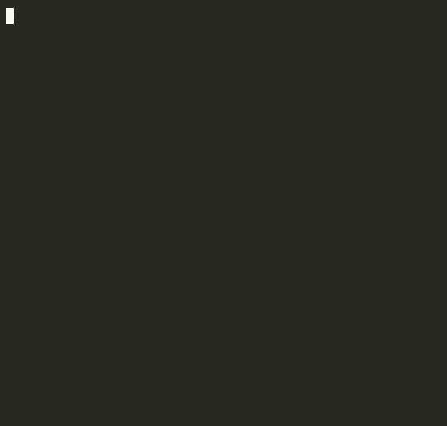

# Credence

**Claude doesn't just forget what you told it. It forgets whether you were sure about it.**

You're in a Claude Code session. You say:
> *"The rate limit is probably around 50, I haven't confirmed it yet."*

Fifteen turns of coding later, Claude writes:

```python
RATE_LIMIT = 50
```

No warning. No flag. The uncertainty is gone. You ship it.
The API rejects every request at 2am. The real limit was 10 — not 50.
Nobody lied. Claude just forgot you weren't sure.

This failure has a name. We defined it, measured it, and fixed it.



**Demo video:** [youtu.be/zKEf2k2bIsU](https://youtu.be/zKEf2k2bIsU) · **3 min**

---

## What Is Credence

**Epistemic Qualifier Loss (EQL)** — the loss of user-stated uncertainty markers during context compression, causing downstream models to treat uncertain claims as confirmed facts.

We measured it across 50 compression scenarios:

| Condition | Qualifier Strip Rate | False Certainty Rate |
|---|---|---|
| Naive Haiku compression | 26% | 12% |
| LLMLingua-style scoring | 68% | 70% |
| Credence (faithfulness probe) | **0%** | **0%** |

Credence is a five-layer epistemic enforcement system built natively into Claude Code. It preserves uncertainty through compression, generation, code output, tool execution, and across session boundaries — deterministically, with zero extra API calls across all five enforcement layers.

Every engineering team using Claude Code today is producing ghost constraints they don't know about. Every sprint.

> Credence was built with Claude Code, deployed as a Claude Code plugin, to protect Claude Code users from Claude Code's own failure mode. Opus 4.7 built a system to guard against Opus 4.7's blind spot.

---

## Quick Start

```bash
git clone https://github.com/Lakshmi-Chakradhar-Vijayarao/credence-ai
cd credence-ai && pip install -e .
python quickstart.py          # all 5 enforcement layers with latency
python demo/live_demo.py      # trace one uncertain claim through the full pipeline
streamlit run demo/app.py     # interactive demo
```

---

## The Opus 4.7 Story — Ghost Detector

The faithfulness probe catches explicit hedges: *"I think"*, *"approximately"*, *"probably"* — 198 markers.

But what about:
> *"The Stripe rate limit is 50 req/min."*

No hedging. Stated as fact. Actually from a sales call, never confirmed. The probe sees nothing. This is a **ghost constraint** — and it is the harder, more dangerous failure.

Only Opus 4.7 can distinguish "established fact" from "vendor claim stated as fact" by reasoning about the *origin and reliability* of a claim — not its surface text. A single structured Opus 4.7 call classifies each constraint. Ghost constraints then flow through all five enforcement layers identically to explicit ones.

```
Ghost Gauntlet — n=10 sessions × 3 conditions, all Opus 4.7

Credence (Ghost Detector active)   BothRate = 1.000   ← value AND qualifier recalled
Naive sliding window               BothRate = 0.200
```

This is the creative use of Opus 4.7 that no rule-based system can replicate — epistemic classification by provenance reasoning.

---

## How It Works

Five checkpoints. Four are fully deterministic — no model cooperation required.

```
User states uncertain claim
        │
        ▼
┌─────────────────────────────────────────────┐
│  REGISTRY  (SQLite, ~0.37ms)                │
│  Stores uncertain constraints with          │
│  confidence decay: j × 0.95^turns           │
│  Cross-session. Zero API calls.             │
└──────────────────────┬──────────────────────┘
                       │
    ▼ before compression
┌──────────────────────────────────────────────┐
│  LAYER 1 — Faithfulness Probe  (~0.07ms)     │  DETERMINISTIC
│  198-marker frozenset. Scans user turns only │
│  Uncertainty found → block Haiku → KEEP      │
└──────────────────────────────────────────────┘
                       │
    ▼ before generation
┌──────────────────────────────────────────────┐
│  LAYER 2 — Truth Buffer + Enforcer           │  PROBABILISTIC
│  Injects all unverified constraints into     │  (Claude must comply)
│  every system prompt. When a query overlaps  │
│  a registered constraint → imperative block  │
│  "YOU MUST express uncertainty."             │
└──────────────────────────────────────────────┘
                       │
    ▼ after generation
┌──────────────────────────────────────────────┐
│  LAYER 3 — Generation-Time Scanner (~0.08ms) │  DETERMINISTIC
│  Catches numeric AND string literals in code │
│  Three tiers: ⚠⚠ HIGH RISK / ⚠ UNVERIFIED  │
└──────────────────────────────────────────────┘
                       │
    ▼ at tool execution
┌──────────────────────────────────────────────┐
│  LAYER 4 — Rust Gate (~3.4ms)                │  DETERMINISTIC
│  Native PreToolUse hook. Blocks Write/Edit/  │
│  Bash when arguments overlap an unverified   │
│  constraint. 98× faster than Python hook.    │
└──────────────────────────────────────────────┘
                       │
    ▼ at session boundary
┌──────────────────────────────────────────────┐
│  LAYER 5 — Cross-Session Memory (<1ms)       │  DETERMINISTIC
│  Snapshots unverified constraints at end of  │
│  session. New sessions inherit uncertainty.  │
└──────────────────────────────────────────────┘

Total: ~0.56ms in-session + 3.4ms gate. Zero extra API calls.
Ghost Detector is opt-in — one Opus 4.7 call per constraint, on registration only.
```

---

## What Gets Blocked

```python
# Without Credence:
TOKEN_EXPIRY = 3600
ALGORITHM    = "RS256"

# With Credence (Generation-Time Scanner):
TOKEN_EXPIRY = 3600   # ⚠⚠ CREDENCE[HIGH RISK, conf=0.15]: auth token expiry unconfirmed
ALGORITHM = "RS256"   # ⚠  CREDENCE[unverified, conf=0.28]: encryption algo — per vendor docs
```

```
╔══════════════════════════════════════════════════════════════╗
║  CREDENCE GATE — TOOL BLOCKED                                ║
╚══════════════════════════════════════════════════════════════╝

  Tool:   Edit
  ⚠ [LOW, conf=0.28] auth token expires in 3600s — unconfirmed
    Overlap terms: token, expires, auth

  Use credence_verify(<id>, <confirmed_value>) to resolve.
```

Once verified, the constraint clears, the gate unblocks, Claude writes the code:

```
uncertain → registered → enforced → verified → released
```

---

## Install in Claude Code (2 minutes)

```bash
pip install fastmcp anthropic
git clone https://github.com/Lakshmi-Chakradhar-Vijayarao/credence-ai
pip install -e credence-ai
```

Add to `.claude/settings.json`:
```json
{
  "mcpServers": {
    "credence": {
      "command": "python3",
      "args": ["-m", "credence.mcp_server"],
      "env": { "ANTHROPIC_API_KEY": "your-key-here" }
    }
  },
  "hooks": {
    "PreToolUse": [{
      "matcher": "Write|Edit|Bash|NotebookEdit",
      "hooks": [{ "type": "command", "command": "credence-gate" }]
    }]
  }
}
```

Build the Rust gate: `cargo build --release` in `credence_gate/`.

---

## All Validated Results

| Experiment | Credence | Naive / Baseline |
|---|---|---|
| Compression — Haiku FCR (n=50) | **0%** | 12.0% |
| Compression — LLMLingua sim FCR (n=50) | **0%** | 70.0% |
| Prompt instruction qualifier survival (n=30) | **100%** (probe) | 90.0% (not deterministic) |
| E6 Long session constraint recall (n=23) | **100%** | 19.6% (naive window) |
| E7 Multi-hop 3-step chain | **3/3 hops** | 0/3 (naive) |
| Ghost Gauntlet BothRate (n=10 sessions) | **1.000** | 0.200 (naive) |
| Cross-session FCR (n=20 callbacks) | **0%** | 40% (no memory) |
| Rust gate latency | **3.4ms** | 331ms (Python) |
| Unit tests | **178/178 pass** | — |

---

## Reproducing the Results

**No API key — free, runs in seconds:**
```bash
python3 tests.py                        # 178 unit tests
python3 test_claims.py                  # validates all submission claims offline
python -m evals.precision_eval          # CE / GTS / probe false-positive rates
python -m evals.stress_test             # n=1000 probe latency, n=200 precision/recall
python -m evals.adversarial_tests       # 5 adversarial robustness tests
python quickstart.py                    # live demo — no API key
python demo/live_demo.py                # trace a single claim through the pipeline
```

**With API key — core evidence (~$7 total):**
```bash
python -m evals.compression_faithfulness --n 50   # headline: 26%→0% EQLR, 12%→0% FCR  (~$3)
python -m evals.null_hypothesis                   # prompt instruction baseline: 90% not 100% (~$1)
python -m evals.ghost_gauntlet                    # BothRate 0.200→1.000 (~$2)
python -m evals.experiments --exp E6              # long session recall: 100% vs 19.6% (~$0.50)
python -m evals.experiments --exp E7              # 3-hop chain: 3/3 vs 0/3 (~$0.20)
python -m evals.experiments --exp E8              # real debugging session recall (~$0.30)
```

All results already saved in `evals/*.json` — no API key needed to read them.

---

## For Reviewers

| What you want to know | Where to find it |
|---|---|
| Research origin, vision, honest assessment | [VISION.md](VISION.md) |
| Full methodology, related work, eval design | [TECHNICAL_REPORT.md](TECHNICAL_REPORT.md) |
| Every number, every run command, all evidence | [SUBMISSION.md](SUBMISSION.md) |
| Layer-by-layer design decisions | [ARCHITECTURE.md](ARCHITECTURE.md) |

---

## Project Structure

```
credence/               Core enforcement package
  context_manager.py    All 5 layers — probe, buffer, scanner, memory
  registry.py           SQLite constraint store + confidence decay
  confidence_proxy.py   J-score (zero API, zero latency)
  memory.py             Cross-session epistemic persistence
  mcp_server.py         FastMCP server — 22 tools

evals/                  Evidence suite (12 studies)
  compression_faithfulness.py   Primary result (n=50)
  ghost_gauntlet.py             Implicit uncertainty benchmark
  experiments.py                E1–E9 ablation experiments

demo/
  app.py                Streamlit UI
  live_demo.py          Terminal demo (no API key needed)

credence_gate/src/main.rs   Rust PreToolUse hook — 3.4ms
tests.py                    178 unit tests
quickstart.py               First-run demo
etp-v1.json                 Epistemic Transport Protocol schema
```

---

## Built By

**Lakshmi Chakradhar Vijayarao** — Independent Researcher · UT Dallas

[LinkedIn](https://www.linkedin.com/in/lakshmichakradharvijayarao/) · [X](https://x.com/LChakradharV28) · [lakshmichakradhar.v@gmail.com](mailto:lakshmichakradhar.v@gmail.com)

---

MIT — see [LICENSE](LICENSE)
